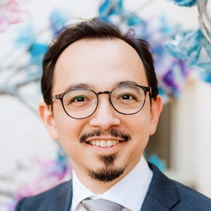

The Syntax/Semantics Lab at the National University of Singapore investigates linguistic theory through the study of languages of Singapore and Southeast Asia.

## Members

{:.member}

  [Michael Yoshitaka Erlewine (mitcho)](/), PI

{:.member}

  [Zheng Shen](https://zheng-shen.github.io/)

{:.member}

[Kenyon Branan](https://sites.google.com/view/kbranan/home), postdoc

{:.member}

[Henrison Hsieh](https://henrison.github.io/), postdoc

<!--{:.member}

[Ryan Walter Smith](https://ryanwaltersmith.wixsite.com/home/), postdoc (starting 2021)
-->

{:.member}

[Keely New](https://keely.news/), RA

{:.member}

Joey Lim, RA

{:.member}

Meghan Lim, RA

{:.member}

Justin Adhiyatma, RA

<strong>You! (<a href="https://careers.nus.edu.sg/NUS/job/Kent-Ridge-Postdoctoral-Fellow-Kent/3900844/">We're hiring a post-doc!</a>)</strong>

<!--
{:.member}

JJ Lim, RA

{:.member}

Wenkai Tay, RA
-->

<!--
{:.member}
[*your name here*](https://linguistlist.org/issues/30/30-3799.html)
-->

## Friends and alumni

* [Bob Beddor](https://www.bobbeddor.com/), NUS Philosophy
* [Tingchun (TC) Chen](https://www.tingchunchen.com/), postdoc 2018--2019; now at National Tsing Hua University, Nanda
* [Hadas Kotek](http://hkotek.com), collaborator
* [Ethan Jerzak](https://www.ocf.berkeley.edu/~jerzak/index.html), NUS Philosophy
* [Ted Levin](https://sites.google.com/site/tfranklevin/), postdoc 2017--2018; now at Facebook
* [JJ Lim](https://jjlim.me), RA 2020; now PhD student at UC San Diego
* [Yosuke Sato](https://scholar.google.com/citations?user=yS1hB4cAAAAJ), at NUS until 2018; now at [Seisen University](https://www.seisen-u.ac.jp/department/undergraduate/english/professors/sato.php)
* Wenkai Tay, RA 2019--2020; now PhD student at University College London
* [Shiao Wei Tham](http://profile.nus.edu.sg/fass/chstsw/), NUS Chinese Language
* [Coppe van Urk](http://webspace.qmul.ac.uk/cvanurk/), collaborator

## [👉🏼 Students](/students/)

## [👉🏼 Reading group](/nus/synsem/)

## Events

* 2021: [The eighth TripleA meeting for semantic fieldworkers](https://lingconf.com/triplea8/)
* 2021: [Austronesian Formal Linguistics Association (AFLA) 28](https://lingconf.com/afla28) with our friends at [McGill](https://www.mcgill.ca/linguistics/)
* 2020: [Austronesian Formal Linguistics Association (AFLA) 27](https://lingconf.com/afla27)
* 2019: [The first Singapore Summer Meeting](https://mitcho.com/singsummer2019/)
* 2019: [Workshop on Approaches to *Wh*-Intervention](https://lingconf.com/intervention/)
* 2018: [Current Issues in Comparative Syntax](https://lingconf.com/compsyn/)
* 2017: [Workshop on Quirks of Subject Extraction](https://mitcho.com/subjex/)
* 2017: [GLOW in Asia XI](https://glowlinguistics.org/asia11/)

## Support

Our work is supported by NUS and the Singapore Ministry of Education through the following grants, among others:

* "The Architecture of Grammar and Discourse" (NUS Presidential Young Professorship research funds)
* "Subjecthood in Southeast Asia: Description and theory" (MOE Tier 2, 2018--2021)
* "Current Issues in Comparative Minimalist Syntax through Asian Perspectives" (MOE Tier 1, 2017--2018)
* "Theory and variation in extraction marking and subject extraction asymmetries" (MOE Tier 1, 2017--2018)

