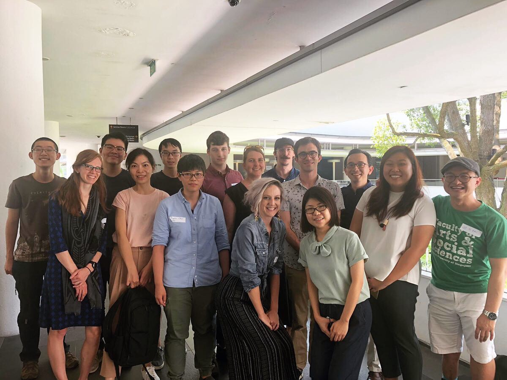

*July 13, 2019, 10am--5pm*

*Location:* NUS [UTown](https://goo.gl/maps/X9ozgUWLvzCV9Ur26) Education Resource Center (ERC) level 2, Seminar Room 11

The Singapore Summer Meeting is an informal meeting of fieldworkers working in Southeast Asia. This year, we'll focus on work on Austronesian languages.

*Schedule*

- 9:30am: visiting speakers meet at Kent Vale "arrival plaza," walk together to UTown
- 10am--noon:
	* [Jozina Vander Klok](https://jozinav.wordpress.com/): Tests and challenges of eliciting weak necessity modality
	* [Sihwei Chen](https://sihweichen.wordpress.com/): Atayal C- reduplication as a general domain widener
	* [Emily Gasser](https://emilygasser.wordpress.com/): Social network analysis & loanwords in NW New Guinea: A first look
- noon--1pm: lunch (UTown food courts)
- 1pm--2:30pm:
	* [Carly Sommerlot](https://mentis.uta.edu/explore/profile/carly%20-sommerlot): Expanding the profile of the Austronesian nasal prefix
	* [Dan Brodkin](https://www.aminef.or.id/dan-brodkin/): *Wh*-questions, pseudoclefts, and pied-piping with inversion in Mandar
- 3--4:30pm:
	* [Kenyon Branan](https://sites.google.com/view/kbranan/home): The Left Edge Ban
	* [Michael Yoshitaka Erlewine](https://mitcho.com): Uses of Tibetan *yin.n'ang*
- Informal dinner

These scholars will informally share their work in progress, recent findings, and fieldwork plans and experiences.

The meeting is open and free for all. [Write me](mailto:mitcho@nus.edu.sg) if you would also like to present something at the meeting.

Organized by [Michael Yoshitaka Erlewine](/). Supported by a grant from [the Singapore Ministry of Education](https://www.moe.gov.sg/).

