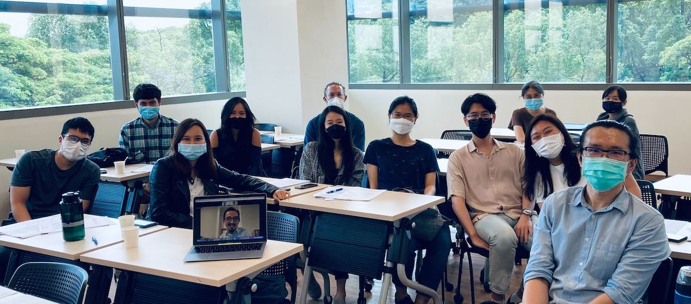

*July 5, 2022, 10am--5pm*

*Location:* NUS AS8 04-02

The Singapore Summer Meeting is an informal meeting of linguists working in Singapore and the region to share their work in progress.

*Schedule*

- 9:30am: coffee
- 10--11:45:
	- [Nick Huang](https://sites.google.com/view/znhuang): Creating a tagged and parsed corpus of Singapore English
	- [Michael Yoshitaka Erlewine](https://mitcho.com) and Anne Nguyen: Degree modifiers in Vietnamese
	- [Tamisha Tan](https://tamishaltan.com): On the origin of morphological classes in Amarasi
- lunch
- 1pm--2:45pm:
	- [Keely New](https://keely.news): Island-sensitivity of wh-the-hell in wh-in-situ languages
	- [Tyler Lemon](https://sites.google.com/view/tyler-lemon): Low nominative agreement in Uab Meto
	- [JJ Lim](https://jjlim.me): Dissociating genitive case assignment and possessor agreement
- break
- 3--4:45pm:
	- [Kenyon Branan](https://sites.google.com/view/kbranan/home): Some thoughts about copy deletion
	- Meghan Lim: Bridging effects of verbs of creation 
	- [Ngui Jian Gang](https://linguistics.arizona.edu/user/jian-gang-ngui): Parasitic gaps and A'-movement in long and short Mandarin bei-passives

The meeting is open and free for all. Organized by Zheng and mitcho. Supported by [the Singapore Ministry of Education](https://www.moe.gov.sg/).

