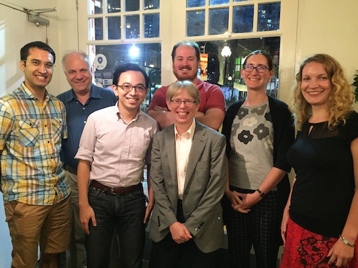

*August 10--11, 2017*

*Location:* National University of Singapore, [AS7](http://map.nus.edu.sg/#page=map&long=103.7711662000000000&lat=1.2946206530000000) room 06-42

**Selected papers from the Workshop appear in [the *Glossa* Special Collection on Subject Extraction](https://www.glossa-journal.org/collections/special/subject-extraction/)**

In many languages of the world, the extraction (e.g. questioning or relativization) of subjects behaves differently from that of non-subject arguments. Such quirks manifest in different forms, but the identification of subjects as the locus of such quirky behavior is remarkably robust across languages. This workshop will bring together a group of established and emerging experts on the cross-linguistic landscape of subject extraction asymmetries, their theory, and implications.

### Schedule

(Unfortunately Maria Polinsky was unable to come to the workshop so the workshop schedule will be adjusted slightly.)

*Thursday, August 10:*

9:30
:	Registration and coffee
:	

10:00
:	[**Māori subject extraction and the intervention of predicate phrases**](douglas.pdf)
:	Jamie Douglas
:	In this paper I consider subject extraction in Māori based primarily on data from reference grammars (Bauer 1993, 1997). I claim that Māori has constructions with verbal, prepositional and nominal predicates, and that subject topicalisation is possible in all constructions, whilst subject questioning/focus is permitted in non-nominal predicate constructions but disallowed in nominal predicate constructions, following de Lacy (1999). I propose that topicalisation is sensitive to the intervention of a nominal argument, whilst questioning/focus is sensitive to the intervention of a nominal phrase (argument or predicate). I integrate this novel intervention analysis with an extension of Belletti’s (2008, 2012, 2015) analysis of clefts to Māori, according to which the embedded clause of a cleft is a focus construction rather than a type of relative clause.

11:00
:	[**Extraction asymmetries and the nature of case**](aldridge.pdf)
:	Edith Aldridge
:	Syntactic ergativity is generally characterized as a constraint on movement such that only the nominal with nominative (“absolutive”) case can undergo extraction operations such as relative clause formation. This constraint has been analyzed in a variety of ways both within and outside of the generative framework, but it is typically assumed to be found only in languages with ergative alignment. Focusing on Austronesian and East Asian languages, I show in this paper that the same constraint can be found in accusative and ergative languages alike. I propose that the constraint is not related to alignment. Rather, what languages with the extraction restriction have in common is the nature of the feature licensing structural case, particularly nominative case, valued on the subject in accusative languages and on the absolutive in ergative languages. Abstracting away from technical details, I propose that structural case in these languages is always located on the phase head and is never inherited (in the sense of Chomsky 2008) by a lower head. Consequently, nominal arguments needing to value case can only undergo Agree with the phase head itself. This results in there being only one landing site capable of hosting movement of a nominal argument, specifically [Spec, CP]. Since movement of a nominal argument can target only this position, there will be no partition between A and A' movement for nominal arguments, and strict locality will always be observed among them.

12:00
:	Lunch (Block AS5 reading room)
:	

2:00
:	[**Extraction asymmetries via case discrimination: evaluating the prospects**](deal.pdf)
:	Amy-Rose Deal
:	A case-discrimination approach to quirks of subject extraction (such as bans on the extraction of ergatives) originates in Otsuka 2006 and has recently been taken up by Deal (2016, 2017) and (for subextraction) by Branan (2017, To appear). Here I review some of the advantages, challenges, and choice points faced by this view. Of special interest are extraction in languages without morphological case (e.g. Gitksan; Brown 2016) and effects of object syntax on subject extraction (e.g. in Mayan agent focus; Henderson and Coon To appear).

3:00
:	[**On the quirks of subject extraction in Igbo A'-dependencies**](georgi.pdf)
:	Doreen Georgi (joint work with Mary Amaechi)
:	In this paper we investigate A'-dependencies in Igbo (Niger-Congo, Nigeria) and the subject / non-subject asymmetry that some of them display. In an ex-situ question or focus construction, questioned / focused non-subjects (direct and indirect objects, adjuncts) require the presence of the marker ka right next to the displaced constituent, while questioned / focused local subjects must not cooccur with ka. Based on novel data, we argue that the morphological asymmetry corresponds to a syntactic asymmetry in the sense that (local) wh-subjects, unlike wh-non-subjects, do not undergo displacement to SpecCP, but stay in their canonical position SpecTP. We present novel evidence that the relevant notion of subject here is about the structurally highest XP (closest to the C-projection), rather than tied to thematic role or case marking. 
Special extraction behavior specifically for local subjects is a pattern we know well from other extraction phenomena (e.g. anti-agreement, reflexes of movement, resumption vs. movement). We will present an analysis for the two asymmetries that is based on the timing of the elementary operations (external + terminal/intermediate internal) Merge and Agree.

4:00
:	Discussion

<!--
:	**Subextraction from subjects: The base position matters**
:	Maria Polinsky
:	This paper examines the observation that not all subject-island violations are alike, testing extraction out of unergative, unaccusative, and transitive subjects in English, Russian, and Circassian. The three languages all treat subjects of transitive verbs as strong islands, disallowing subextraction out of these DPs in any position.  With respect to intransitive subjects, the three languages differ as follows. Despite some individual variation, English does not allow subextraction out of subjects regardless of the type of the predicate. In Russian, extraction out of internal arguments (unaccusative subjects and direct objects) is possible out of their base position but once the internal argument scrambles to a different position it becomes frozen for subextraction. In Circassian, extraction out of both types of intransitive subjects (unergative and unaccusative) is possible, although unaccusative subjects are more transparent. I propose that the difference between Russian and Circassian has to do with the presence of a more articulated structure of the verb phrase in Russian as compared to the verb phrase in Circassian.
-->

*Friday, August 11:*

9:30
:	Coffee
:	

10:00
:	[**Quirks of Agreement under Extraction**](baier.pdf)
:	Nico Baier
:	Many languages exhibit anti-agreement (AA), an effect in which φ-agreement with a DP is apparently blocked when that DP is A'-extracted (e.g. Ouhalla 1993). In this paper, I argue against the view that AA arises because A'-movement of a DP renders syntactic agreement with that DP illicit (Ouhalla 1993, Schneider-Zioga 2007, Diercks 2010, Erlewine 2016, a.o.). Instead, I argue that AA is the morphological result of agreement with a DP bearing the features typically associated with A'-extraction (A'-features). In other words, anti-agreement is just an instance of wh-agreement – dedicated agreement morphology that indexes extracted arguments (Georgopoulos 1991, Watanabe 1996, Chung 1998, a.o.). The effect is the result of a φ-probe copying both φ- and A'-features from a goal. AA arises when partial or total impoverishment applies to the [φ+A'] feature bundle in the morphological component, blocking insertion of an otherwise appropriate, more highly specified agreement exponent. 

11:00
:	[**The anti-locality signature of quirks of subject extraction**](erlewine.pdf)
:	Michael Yoshitaka Erlewine
:	In many languages, one property of subjects that distinguishes them from other arguments is their uniquely high position in the clause. A'-extraction of the subject thus may uniquely run afowl of anti-locality constraints on movement, which ban movement which is too close (see e.g. Grohmann 2003, Cheng 2007, Erlewine 2016, 2017, Bošković 2016, Douglas 2016). Quirks of subject extraction that are driven by anti-locality constraints exhibit a particular "signature": (a) obviation when additional material is added above the subject, (b) its applicability to non-subjects that are exceptionally high, and (c) no correlation with other subjecthood properties such as case. Relevant examples from Highest Subject Restriction, subject anti-agreement, and complementizer-trace effects are discussed.

12:00
:	Lunch (Block AS5 reading room)
:	

2:00
:	[**Exfoliation: A Derivational Theory of Clause Size**](pesetsky.pdf)
:	David Pesetsky
:	I will argue that an array of subject/non-subject asymmetries fall together with facts about infinitives usually taken to follow from Case theory — in the context of a 21st-century revival of ideas concerning clause-type differentiation from the earliest days of generative grammar (Rosenbaum 1965, 1967).

3:00
:	Discussion

### Additional information

Workshop attendance is free for all.

Organized by [Michael Yoshitaka Erlewine](/). Supported by a grant from [the Singapore Ministry of Education](https://www.moe.gov.sg/).